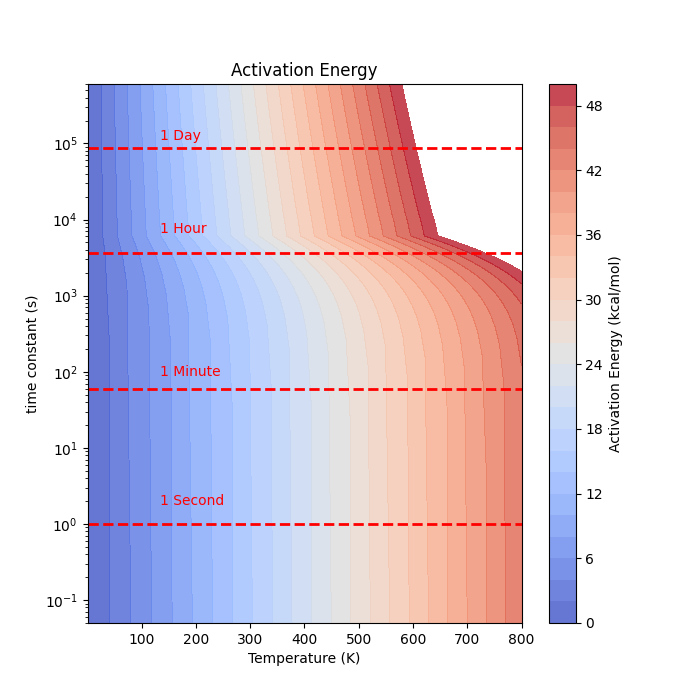

最終更新：2024-07-16

## 概要

　[遷移状態理論](https://en.wikipedia.org/wiki/Transition_state_theory)に基づいて、反応時間と温度を与えると、超えうる活性化障壁の大きさを算出するプログラムを書いてみる。
　活性化障壁を算出するために、以下の数式を用いる。

$$k_{r} = \Gamma \frac{k_{B}T}{h} exp(-\frac{\delta G^{‡}}{RT}) $$
ここで、$ \Gamma $はトンネル効果の補正項である。今回は1とする。
$k_{r}$は反応速度定数$[s^{-1} ]$、$k_{B}$はボルツマン定数$[J K^{-1}]$、Tは絶対温度$[K ]$、hはプランク定数$[J・s ]$、$\delta G^{‡}$は活性化障壁、Rは気体定数$[J mol^{-1} K^{-1} ]$である。


## 環境
 - python 3.x 
 - Linux (WSL, Ubuntu 22.04.4 LTS)

## コード


```python
import numpy as np
import matplotlib.pyplot as plt
from matplotlib import cm

# Constants

GAS_CONST = 8.31446261815324 # J/(mol K)
PLANCK_CONST = 6.62607015e-34 # J s
BOLTZMANN_CONST = 1.380649e-23 # J/K

# Eyring–Polanyi equation (J. Chem. Phys. 3, 107–115 (1935))
def eyring_polanyi(T, k_r, gamma=1.0):
    activation_energy = -1 * (0.001 / 4.184) * GAS_CONST * T * np.log(k_r * PLANCK_CONST / (T * BOLTZMANN_CONST * gamma))
    return activation_energy # kcal/mol
 
# Data
T = np.linspace(1e-5, 800, 100) # K
tau = np.linspace(1e-5, 3600*24*7, 100) # s
k_r = 1 / tau

mesh_T, mesh_k_r = np.meshgrid(T, k_r)

# calculate activation energy
AE = eyring_polanyi(mesh_T, mesh_k_r)

#Plot Data
fig, ax = plt.subplots(figsize=(7, 7))


level = []
for i in np.linspace(np.min(AE), 50, 26):
    level.append(i)

contour = plt.contourf(T, tau, AE, levels=level, cmap='coolwarm', alpha=0.8, vmax=50, vmin=np.min(AE))

highlight_value = 60 # 1 Minute   
ax.axhline(y=highlight_value, color='red', linestyle='--', linewidth=2)
ax.text(max(T)/6, highlight_value + 40, '1 Minute', color='red', verticalalignment='center')
print("Activation Energy at 1 Minute (300 K): ", eyring_polanyi(300, 1/60), "kcal/mol")
print("Activation Energy at 1 Minute (400 K): ", eyring_polanyi(400, 1/60), "kcal/mol")
print("Activation Energy at 1 Minute (500 K): ", eyring_polanyi(500, 1/60), "kcal/mol")

highlight_value = 3600 # 1hour
ax.axhline(y=highlight_value, color='red', linestyle='--', linewidth=2)
ax.text(max(T)/6, highlight_value + 4000, '1 Hour', color='red', verticalalignment='center')
print("Activation Energy at 1 Hour (300 K): ", eyring_polanyi(300, 1/(3600)), "kcal/mol")
print("Activation Energy at 1 Hour (400 K): ", eyring_polanyi(400, 1/(3600)), "kcal/mol")
print("Activation Energy at 1 Hour (500 K): ", eyring_polanyi(500, 1/(3600)), "kcal/mol")


highlight_value = 3600 * 24 # 1day
ax.axhline(y=highlight_value, color='red', linestyle='--', linewidth=2)
ax.text(max(T)/6, highlight_value + 40000, '1 Day', color='red', verticalalignment='center')
print("Activation Energy at 1 Day (300 K): ", eyring_polanyi(300, 1/(3600*24)), "kcal/mol")
print("Activation Energy at 1 Day (400 K): ", eyring_polanyi(400, 1/(3600*24)), "kcal/mol")
print("Activation Energy at 1 Day (500 K): ", eyring_polanyi(500, 1/(3600*24)), "kcal/mol")

ax.set_yscale('log')
ax.set_xlabel('Temperature (K)')
ax.set_ylabel('time constant (s)')
ax.set_title('Activation Energy')

plt.colorbar(label='Activation Energy (kcal/mol)')
plt.show()
```

## 出力


```
Activation Energy at 1 Second (300 K):  17.565152974273015 kcal/mol
Activation Energy at 1 Second (400 K):  23.648877181501675 kcal/mol
Activation Energy at 1 Second (500 K):  29.782812384607013 kcal/mol
Activation Energy at 1 Minute (300 K):  20.00604265939022 kcal/mol
Activation Energy at 1 Minute (400 K):  26.903396761657955 kcal/mol
Activation Energy at 1 Minute (500 K):  33.85096185980236 kcal/mol
Activation Energy at 1 Hour (300 K):  22.44693234450743 kcal/mol
Activation Energy at 1 Hour (400 K):  30.15791634181423 kcal/mol
Activation Energy at 1 Hour (500 K):  37.9191113349977 kcal/mol
Activation Energy at 1 Day (300 K):  24.3415649762646 kcal/mol
Activation Energy at 1 Day (400 K):  32.68409318415713 kcal/mol
Activation Energy at 1 Day (500 K):  41.07683238792632 kcal/mol
```




ソースコードは[こちら](./plot.py)

